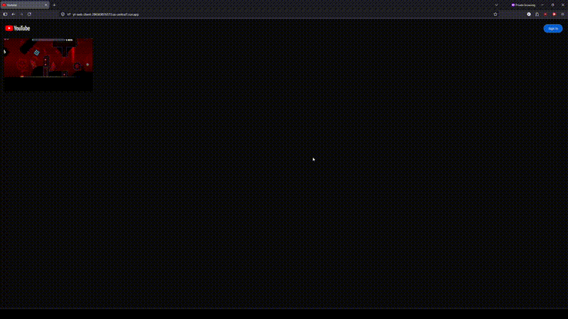

# Youtube Clone

A full-stack video sharing platform that allows users to upload, process, and stream videos with authentication and scalable cloud infrastructure.

## Demo

## Features
- Video upload and streaming
- Asynchronous video processing pipeline
- Storage using google cloud services
- Frontend UI

## Tech Stack
- Frontend: Next.js / React
- Backend: Node.js / Express
- Database: Firestore (Firebase)
- Cloud: Google Cloud (Cloud Run, Pub/Sub)
- DevOps: Docker

## Architecture
1. User uploads video via signed URL directly to GCS
2. Pub/Sub triggers the processing service
3. Processing service converts to 360p and generates thumbnail
4. Processed video and thumbnail are stored in GCS
5. Metadata is saved to Firestore
6. Web client displays the processed thumbnails with links to stream each video

## Challenges & Learnings
- Configured CORS on GCS to allow cross-origin video streaming from the browser
- Added automatic refreshing of the web client when the user signs in/out
- Utilized remote patterns in Next.js to allow the usage of external thumbnail URLs in the Image component
- Designed the Pub/Sub pipeline to handle duplicate message delivery to the video processing service, preventing duplicate processing jobs
